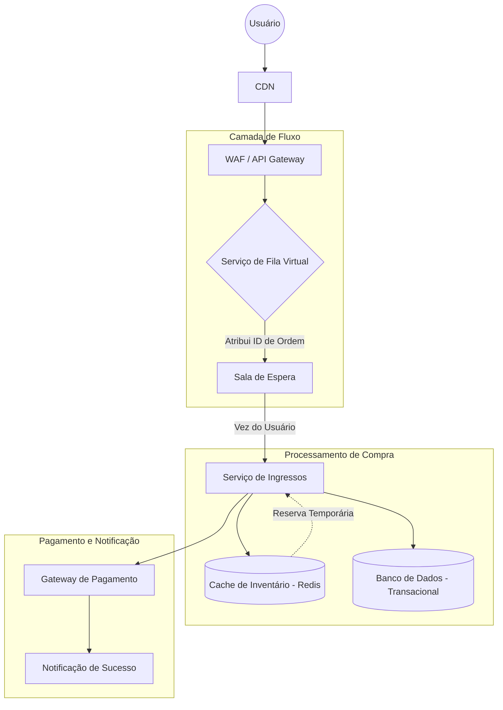

# concert-tickets

```mermaid
flowchart TB
 subgraph subGraph0["Camada de Fluxo"]
        QueueService{"Serviço de Fila Virtual"}
        WAF["WAF / API Gateway"]
        WaitingRoom["Sala de Espera"]
  end
 subgraph subGraph1["Processamento de Compra"]
        TicketSvc["Serviço de Ingressos"]
        Redis[("Cache de Inventário - Redis")]
        DB[("Banco de Dados - Transacional")]
  end
 subgraph subGraph2["Pagamento e Notificação"]
        PaySvc["Gateway de Pagamento"]
        EmailSvc["Notificação de Sucesso"]
  end
    User(("Usuário")) --> CDN["CDN"]
    CDN --> WAF
    WAF --> QueueService
    QueueService -- Atribui ID de Ordem --> WaitingRoom
    WaitingRoom -- Vez do Usuário --> TicketSvc
    TicketSvc --> Redis & DB & PaySvc
    PaySvc --> EmailSvc
    Redis -. Reserva Temporária .-> TicketSvc
```
